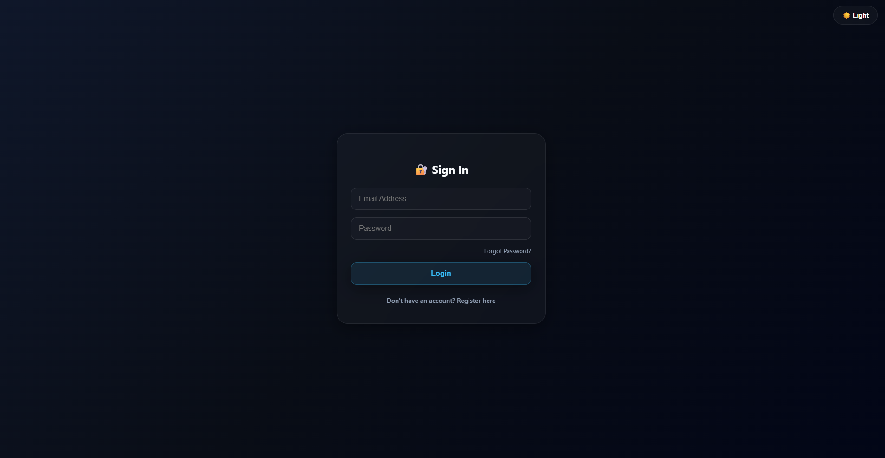
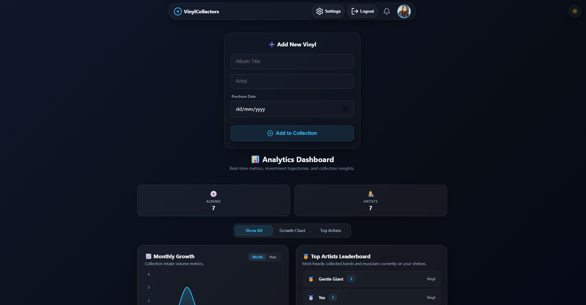
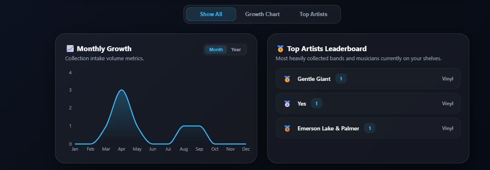
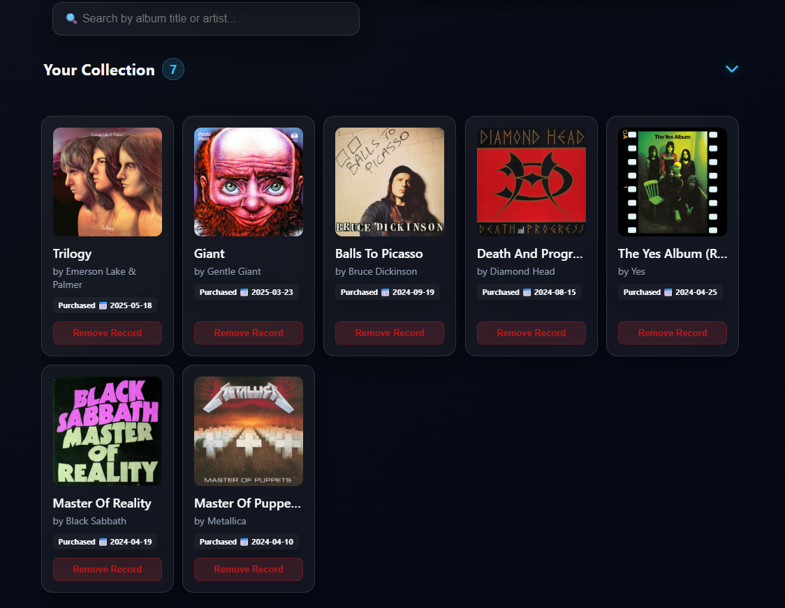

# Vinyl Collectors Application 

A professional, high-performance, enterprise-grade Progressive Web Application (PWA) packaged natively for the Microsoft Store. Vinyl Collectors provides high-fidelity archiving, advanced discography data indexing, and lifetime collection management optimized for modern Windows environments. 

##  Key Engineering & Architecture Highlights

##  Interface Preview

### Desktop - Dark Mode

| Login | Home |
| :---: | :---: |
|  |  |

| Analytics | Grid View |
| :---: | :---: |
|  |  |

| Card Maximized |
| :---: |
|  |

### Desktop - Light Mode

| Home Light | Grid Light |
| :---: | :---: |
|  |  |

### Mobile Experience

| Mobile Screen |
| :---: |
|  |

- **Native Windows Billing Architecture:** Implements a direct, secure integration with the Microsoft Store billing engine through standard WinRT Core SDK Hooks (`StoreContext`) for premium lifetime unlocks.
- **Industrial-Grade Perimeter Security:** Features a bulletproof Hostname Lock Framework that blocks mobile platform simulation or browser exploit bypasses. Free checkout loops are strictly blocked on the web network layer.
- **Automated Metadata Telemetry Sanitization:** Powered by a customized backend Regex scrubbing engine that strips music platform streaming pollution text (e.g., *Remastered, [Live], Deluxe*) to execute high-accuracy external search handshakes.
- **Persistent SQLite Data Cloud:** Seamless cloud deployment running on a paid Render Hobby cluster (\$7) mapping relational tables with permanent SQLite persistent storage layers.
- **Modern Glassmorphic UI:** High-fidelity micro-frontend architecture featuring advanced responsive modal alignment and crisp neon layout parameters.

##  The Tech Stack Grid

| Layer | Technologies Leveraged |
| :--- | :--- |
| **Frontend UI** | React, TypeScript, Axios, Vercel Production Network, Flexbox Layout Rules |
| **Backend API** | Python, FastAPI, SQLite Relational Database Engine, HTTPX Asynchronous Network Connections |
| **Ecosystem** | Microsoft Partner Center Package Ecosystem, Microsoft Store Native Wrapper Engine (WebView2), Windows NT Client Verification Arrays |
| **Telemetry** | Discogs Database API Database Metadata Synchronization |

##  Core Code Implementations

### 1. Defensive Hostname Billing Validation (`src/components/AddVinyl.tsx`)

```typescript
// Restricts simulated sandbox testing strictly to local loops, forcing Microsoft certification checkouts live
const hasWindowsStore = typeof window !== "undefined" && (window as any).Windows?.Services?.Store?.StoreContext;
const isLocalhostTest = window.location.hostname === "localhost" || window.location.hostname === "127.0.0.1";

if (!hasWindowsStore && !isLocalhostTest) {
 alert("Checkout services for mobile platforms are currently undergoing registration protocols.");
 return; // Strict return execution halt
}
```

### 2. Asynchronous Metadata Token Verification Routines (`backend/app`)
*Fully validated PUT database endpoints managing premium authorization schemas via SQLite*

```python
@router.put("/profile/upgrade")
async def upgrade_to_premium(current_user: DBUser = Depends(get_current_user), db: Session = Depends(get_db)):
   current_user.is_premium = True
   db.commit()
   db.refresh(current_user)
   return {"status": "success", "message": "Premium storage unlocked."}
```

## 🌍 Global Production & Network Deployment Profiles

- **Frontend Client Hosting:** Managed via continuous deployment pipelines on Vercel ([vinyl-app-6cla.vercel.app](https://vercel.app)).
- **Backend Server Cluster:** Orchestrated live on the Render Hobby Infrastructure ([vinyl-app-jj9s.onrender.com](https://onrender.com)).
- **Distribution Matrix:** Distributed via signed desktop installation architecture directly through the [Official Microsoft Store](https://apps.microsoft.com/detail/9pbdk8vtw9m3?hl=en-GB&gl=GB).

---
*Developed by **Wesley Israel da Cunha**. Built for audiophiles and professional record preservation specialists worldwide.*
